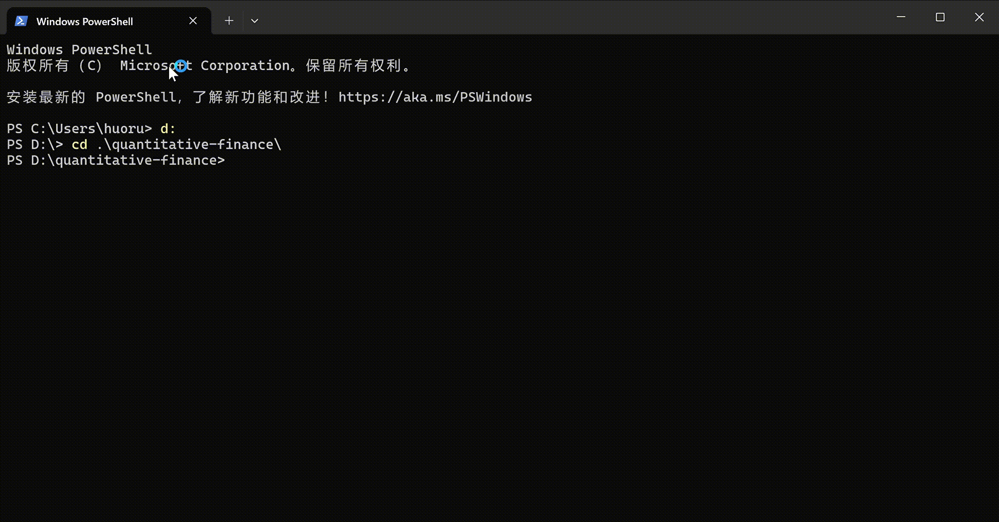

# quantitative-finance


## Overview
This project is designed to predict stock cumulative returns based on financial features such as PE (Price-to-Earnings ratio) and PB (Price-to-Book ratio). The program utilizes data from the Baostock API and applies three different machine learning models to perform predictions:
- Linear Regression
- Random Forest Regressor
- Multi-Layer Perceptron (MLP) Regressor

The best model is selected based on the lowest prediction error.

## Features
- Fetches stock data from the Baostock API.
- Calculates cumulative returns for given stocks over a specified period.
- Extracts and preprocesses financial features (PE, PB).
- Trains and evaluates multiple machine learning models.
- Selects the best-performing model based on prediction accuracy.
- Outputs results to a CSV file.

## Installation & Dependencies
### Prerequisites
Ensure you have the following installed:
- Python 3.x
- Baostock Library (`baostock`)
- Pandas (`pandas`)
- Scikit-learn (`sklearn`)


### Functionality
1. **Fetching Stock Data**
   - Retrieves stock market data using Baostock API.
   - Computes cumulative returns for each stock.
2. **Model Training**
   - Uses `StandardScaler` to normalize data.
   - Trains three models: Linear Regression, Random Forest, and MLP Regressor.
3. **Prediction & Evaluation**
   - Predicts cumulative returns for test data.
   - Computes errors for each model.
   - Determines the best-performing model.
4. **Results Output**
   - Prints predictions and the best model.
   - Saves predictions as a CSV file (`output2.csv`).


## Example Output
```
All test stock predictions:
      Stock  Cumulative Return  Predicted Cumulative Return (Linear)  ...
sh.601688       0.12                                0.10              ...
Best model: Random Forest
```



## Author
Developed by Huo ruiqi

